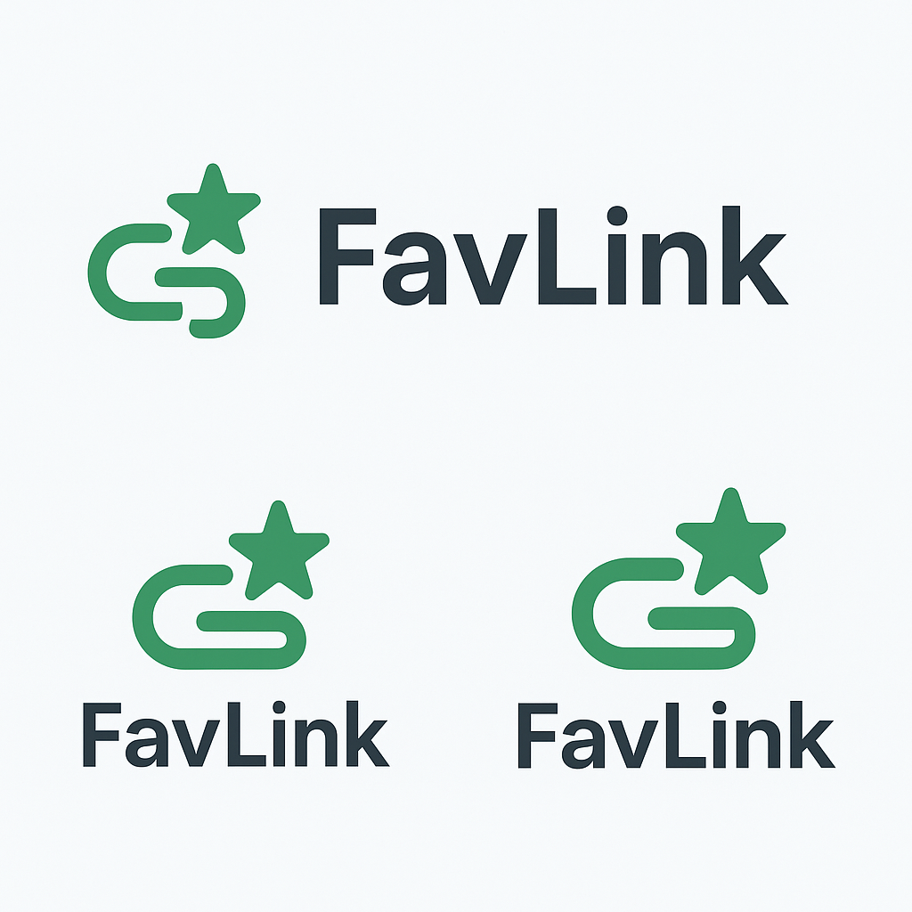

Make a logo for my app "FavLink" for a responsive website. The app let user manage their favorite links via the Internet. Ask me questions to help you design the logo.
ChatGPT said:

Got it 👍 Let’s make sure the logo for “FavLink” really reflects your app and feels good across devices (desktop + mobile). To design it right, I’ll need some preferences from you first:

Style – Do you prefer a modern and minimal look, a playful and friendly one, or a more professional/corporate vibe?

Colors – Do you have a brand palette already, or should I suggest some (e.g., blue = trust, green = growth, orange = creativity)?

Symbol/Icon – Should the logo include a recognizable symbol (like a link chain, star/favorite icon, or bookmark) or be purely text-based?

Typography – Do you like clean sans-serif fonts (modern) or something more distinctive/stylized?

Usage – Will the logo be used mainly in the website navbar and favicon, or also in apps, print, presentations?

Mood/Message – What do you want users to feel when they see it (e.g., organized, fun, reliable, secure, creative)?

👉 Would you like me to propose a few concept sketches (symbols + color schemes) first, or should I directly generate a ready-to-use logo draft?

You said:
Style = modern and minimal
Colors = growth
Symbol/Icon = ink chain, star
Typography = sans-serif fonts
Usage = website navbar
Mood/Message = organized

Make three options. Create concept sketch. Then when. I approve make the ready-to-use.

## Background

This project is at
https://github.com/chayapan/favlinks-backend-django

[15:49] Pop Panupong (Unverified)

Coding Interview
https://forms.gle/qWSaiSVvp5QEZC3o6
5fs14d2564b251c
[16:48] Pop Panupong (Unverified)

Project: https://forms.gle/eHDD6SxkyH3n5a1b7
5fs14d2564b251c

1. wsgi for Django
https://docs.djangoproject.com/en/5.0/howto/deployment/wsgi/uwsgi/

2. Django and nginx
https://uwsgi-docs.readthedocs.io/en/latest/tutorials/Django_and_nginx.html

3. Python collection API
https://docs.python.org/3/library/collections.html#collections.defaultdict

4. nested list
https://docs.python.org/3/tutorial/datastructures.html#nested-list-comprehensions

Submit before T+7 23.59:59 BKK Time
https://docs.google.com/forms/d/e/1FAIpQLSclNMIw-AAqTpm8kpgY3CopOKLExZq0Z0jKI4vyEDEewAFQ9Q/viewform

Encode organization open-source
https://www.encode.io/articles/

Django REST framework
https://www.django-rest-framework.org/

The Web browsable API is a huge usability win for your developers.
Authentication policies including packages for OAuth1a and OAuth2.
Serialization that supports both ORM and non-ORM data sources.

Customizable all the way down - just use regular function-based views 

pip install djangorestframework
pip install markdown       # Markdown support for the browsable API.
pip install django-filter  # Filtering support

Quickstart
https://www.django-rest-framework.org/tutorial/quickstart/

Could not resolve URL for hyperlinked relationship
https://stackoverflow.com/questions/20550598/django-rest-framework-could-not-resolve-url-for-hyperlinked-relationship-using

https://stackoverflow.com/questions/71312665/you-may-have-failed-to-include-the-related-model-in-your-api-or-incorrectly-con
