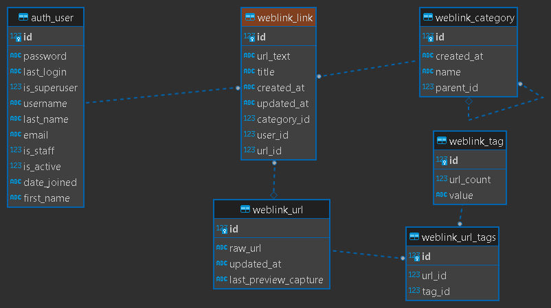

# Data Model of The Service

The backend of this service uses Django ORM to define information records supporting the application. The objects definition for the service is in [../weblink/models.py]():

```
User
Category
Tag
URL
Link
```

User class is imported from *django.contrib.auth.models* of the framework. It is the identity of service users and for each web link added to the favorite collection a user is the owner of such record.

Category class is the category of a web link. When the user creates the link a category is chosen. Category is a hierarchy so a category can have a parent category and children.

Tag class is the tag associated with a web link. Each web link can have several tags or none. Tags are added after the link has been created in the user's collection.

URL class represents the web URL. This object represent generic URLs on the web and is hashed and shared across the system.

Link class is the association between a user and the web link. This object also associate with category and tags.

ER diagram of this model might look like the following:

