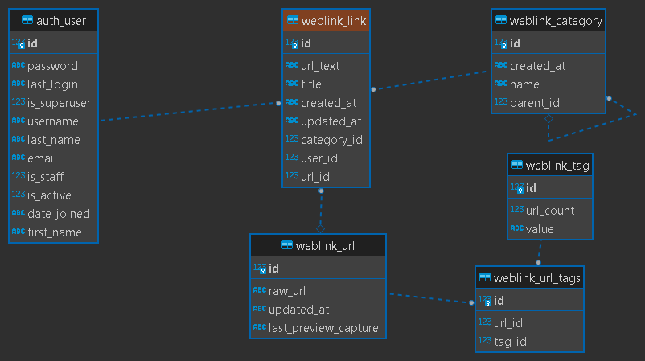

Django 5.0 

See settings reference at  
https://docs.djangoproject.com/en/5.0/topics/settings/  
https://docs.djangoproject.com/en/5.0/ref/settings/

Quick-start development settings - unsuitable for production  
See https://docs.djangoproject.com/en/5.0/howto/deployment/checklist/

[Cloud run](../docs/CLOUD_RUN.md)

Database https://docs.djangoproject.com/en/5.0/ref/settings/#databases  
Password validation https://docs.djangoproject.com/en/5.0/ref/settings/#auth-password-validators

Internationalization https://docs.djangoproject.com/en/5.0/topics/i18n/

Static files (CSS, JavaScript, Images)  
https://docs.djangoproject.com/en/5.0/howto/static-files/

Default primary key field type https://docs.djangoproject.com/en/5.0/ref/settings/#default-auto-field

See https://www.django-rest-framework.org#installation
Review authen/token https://www.django-rest-framework.org/api-guide/authentication/#with-django-admin
Use Django's standard `django.contrib.auth` permissions, or allow read-only access for unauthenticated users.

